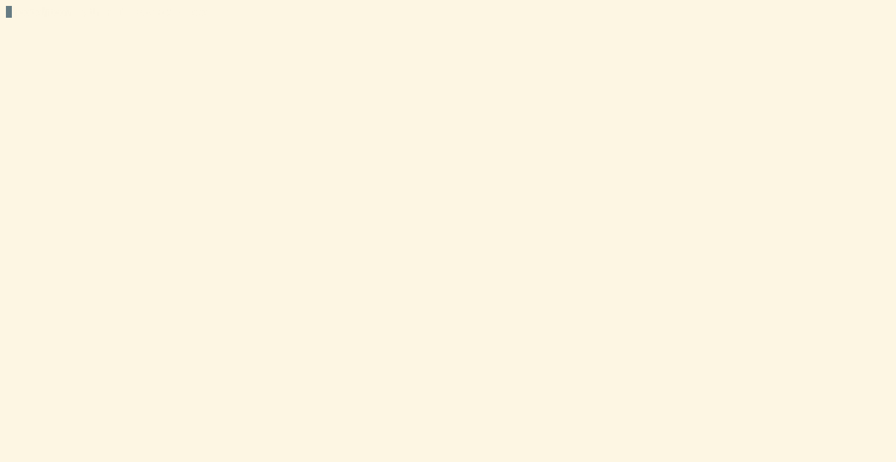

# TCOV: View Coverage Distribution in Terminal

## WHY

`IGV` is awesome, but not every server can let every user launch it.

 If you just want to simply view the distribution of reads coverage, this may be more direct😎.

## HOW

### INSTALL

```bash
git clone https://github.com/wjwei-handsome/tcov.git
cd tcov
cargo build --release
```
or just

```bash
cargo install --git https://github.com/wjwei-handsome/tcov.git
```

### EXAMPLE

```bash
tcov -b data/test.bam -r 2:2078887-2079669
```


### USAGE

```bash
tcov -- View coverage data in terminal

Version: 0.1.0

Authors: Wenjie Wei <wjwei9908@gmail.com>

Usage: tcov [OPTIONS] --bam <BAM> --region <REGION>

Options:
  -h, --help     Print help (see more with '--help')
  -V, --version  Print version

Input Options:
  -b, --bam <BAM>        Input bam file with index
  -r, --region <REGION>  input region, format: chr:start-end

Display Options:
  -c, --color <COLOR>          Display color for coverage [default: blue] [possible values: black, red, green, yellow, blue, magenta, cyan, gray, darkgray, lightred, lightgreen, lightyellow, lightblue, lightmagenta, lightcyan, white]
  -s, --step-size <STEP_SIZE>  Step size for moving the view [default: 10]

Filter Options:
  -i, --include-flags <INCLUDE_FLAGS>  Included flags [default: 0]
  -e, --exclude-flags <EXCLUDE_FLAGS>  Excluded flags [default: 0]
  -m, --min-mapq <MIN_MAPQ>            Minimum mapping quality [default: 0]
```

## FEATURES

1. Blazing fast, written in Rust.
2. Filter reads by flags and mapping quality.
3. Dynamic coordinate indication.

## TODO

- [ ] Maybe multiple tracks support ??

## CONTRIBUTING

>[!IMPORTANT]
>This is a mini fun project with no plans to expand unrelated features.

If you have any suggestions or find any bugs, please feel free to open an issue or PR.

## LICENSE

[MIT License](./LICENSE) © WenjieWei